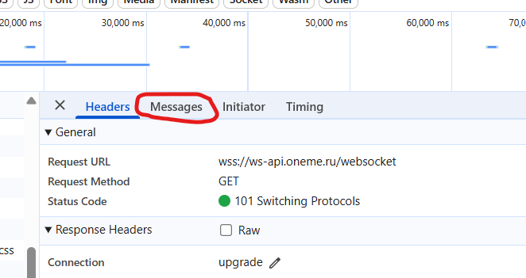
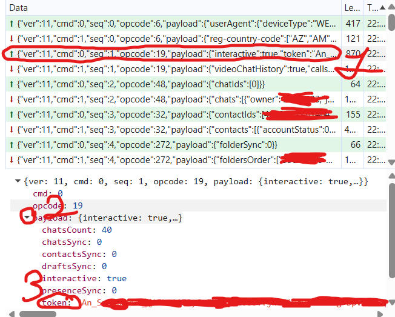

# maxclientapi
A Python library for working with the 'MAX Messenger' WebSocket API

## Example code
```python
import maxclientapi
import time

token = "YOUR TOKEN"
deviceId = "YOUR DEVICEID"

client1 = maxclientapi.ChatClient(token=token, deviceId=deviceId) # Creating object 

client1.connect() # Connecting to the server
client1.send_message(chat_id=-68747088628439, text="Hello")
client1.request_messages() # Request last messages
client1.start_keepalive() # Creating a ping pong connection between a client and a server
client1.subscribe_chat(chat_id=ANY CHAT ID WITHOUT "") # Subscribe to chat 
time.sleep(60) # Time to get all messages from chat, You can increase the number
client1.stop() # Stop connection
```

## How to get token and deviceId?
Go to https://web.max.ru, press F12 and find the websocket 

then go to messages 

and find the first two messages 

then do as shown in these two photos to copy the values 


